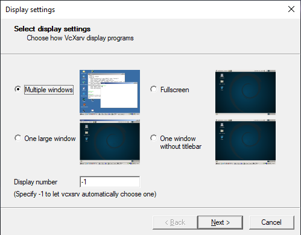
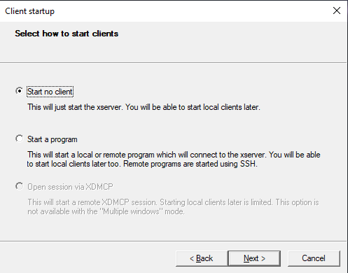
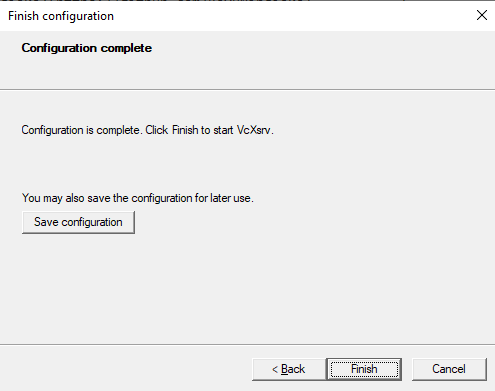

> Rifan Firmansyah (119140055) - Sistem Operasi RB

# InvasiUFO 
InvasiUFO merupakan sebuah game dengan tema penyerangan yang dilakukan oleh UFO. Game ini diambil dari project game aliens dengan tautan berikut [Klik disini](https://github.com/xamox/pygame/blob/master/examples/aliens.py). Game ini ber genre action, retro, shoot 'em up.

InvasiUFO sendiri saya gunakan untuk nama pada game, yang sebelumnya hanya bernama Aliens. Nama tersebut menurut saya sangat cocok karena pada game ini hanya menggunakan 1 player dan banyaknya UFO yang memberikan tembakan peluru.

Cara Bermain
- Hindari Bomb yang dijatuhkan oleh UFO
- Hindari Player menabrak UFO
- Tekan `⇽` untuk gerak ke kiri
- Tekan ` ⇾` untuk gerak ke kanan
- Tekan `space` untuk nembak UFO

## Cara Menjalankan Container
- Unduh repository dengan [klik disini](https://github.com/rifan-frmsh/InvasiUFO/archive/refs/heads/main.zip) lalu pindahkan file tersebut ke disk `(D:)`
- Unduh vcxsrv dan install, fungsinya sebagai GUI untuk menjalankan game ini [klik disini](https://downloads.sourceforge.net/project/vcxsrv/vcxsrv/1.20.14.0/vcxsrv-64.1.20.14.0.installer.exe?ts=gAAAAABikM4htiS-mb2njw45IMlr5iPITdvV6w5QqC2tlvxcF5u9QUvHH742ZgREwNiP9q8K8-TvhIPFacna04QFFrmqVtzk7A%3D%3D&r=https%3A%2F%2Fsourceforge.net%2Fprojects%2Fvcxsrv%2Ffiles%2Flatest%2Fdownload)
- jalankan Xlaunch seperti gambar
<div align="center"> 

  

  

  

</div>

- kemudian buka folder dengan vscode 
- sebelum lanjut pastikan docker sudah aktif
- pergi ke Terminal dan jalankan syntax berikut untuk build docker
```
docker build -t invasiufo .
```
- proses build sudah selesai, untuk cek images yang dibuat jalankan syntax berikut maka akan terlihat images `invasiufo` yang menandakan proses build berhasil
```
docker images
``` 
- selanjutnya jalankan container dengan syntax berikut
```
docker run --privileged -it --rm --cap-add=SYS_PTRACE -u 0:0 -e DISPLAY=192.168.1.4:0.0 -v /d/InvasiUFO-main:/home/apps invasiufo /bin/bash
```
untuk `DISPLAY` sesuaikan dengan ip yang anda punya
- lalu ketik `ls` untuk melihat file yang ada di dalam container, jika build sukses maka terlihat beberapa file dari program game ini
- terakhir jalankan syntax berikut untuk memulai game
```
python main.py
```

## Demo Container
[](https://youtu.be/L3DLqjyIIXM)
